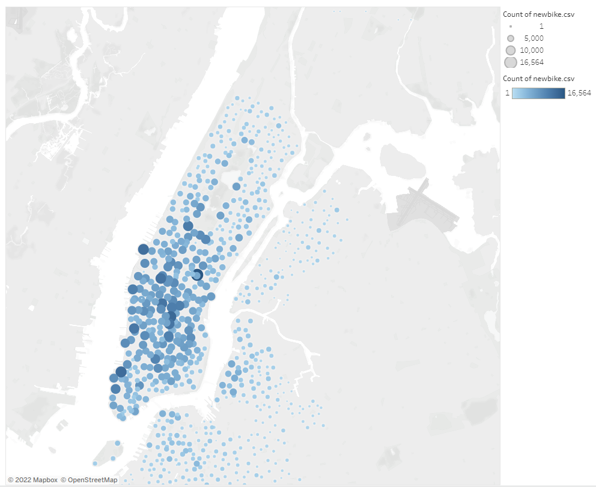

# Module 14 Challenge - NYC Bikesharing Data with Tableau
## Overview of Statistical Analysis
The purpose of this analysis is to determine whether Des Moine, Iowa can create a similar bikesharing service as the successful New York City company CitiBike. Along with general rider data, further analysis was performed regarding bike trips.

[Link to Tableau Visualization Dashboard](https://public.tableau.com/app/profile/alice.f.hayden/viz/NYCBikesharingDataChallenge/NYCBikesharingRiderData?publish=yes)

## Results
There are nine (9) visualizations for this analysis.

### 1) Number of User Types
Below is the number of Customers vs. Subscribers.

### 2) Number of Trips by Gender
Below is the number of trips by Gender.

### 3) Checkout Times for Users
This linegraph displays the number of biker usage during the hours of the day.

### 4) Checkout Times by Gender
This linegraph displays the number of biker usage during the hours of the day by gender

### 5) Trips by Weekday per Hour
There is a heatmap for trips by weekday.

### 6) Trips by Gender per Weekday by Hour
The heatmap was expanded to show trips by gender.

### 7) User Type Breakout by Weekday and Gender
The heatmap was expanded to show trips by user type and gender.

### 8) Heatmap of Wheres Bikers Start
This maps displays the amount of traffic geographically when a biker begins their journey.

### 9) Heatmap of Wheres Bikers End
This maps displays the amount of traffic geographically when a biker ends their journey.

## Summary
It seems that there are way more male riders than there are female. Most people subscribe to the Rider program. Males and females use the bikes at similar times through the week and day, there is just a lot more males users.

## Two (2) Additional Visualization Recommendations
* Display a map of riders by age on a geographical map - perhaps specific bikes that are easier to handle could be placed in areas that are more populated by the elderly to ensourage usage.
* Bar Chart - Provide a breakout of users by age to determine the best type of marketing or social media avenue to take.

